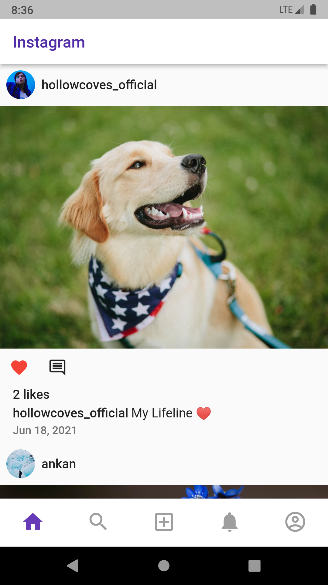
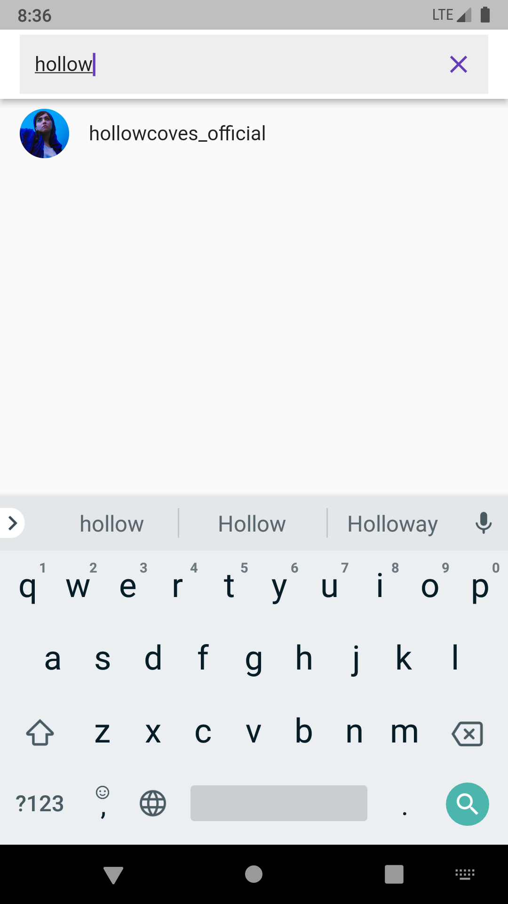
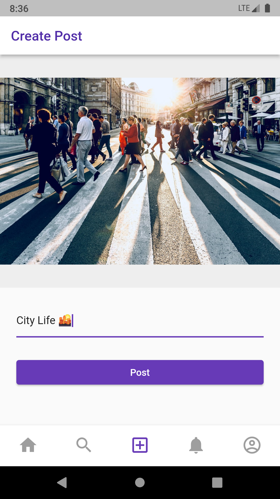
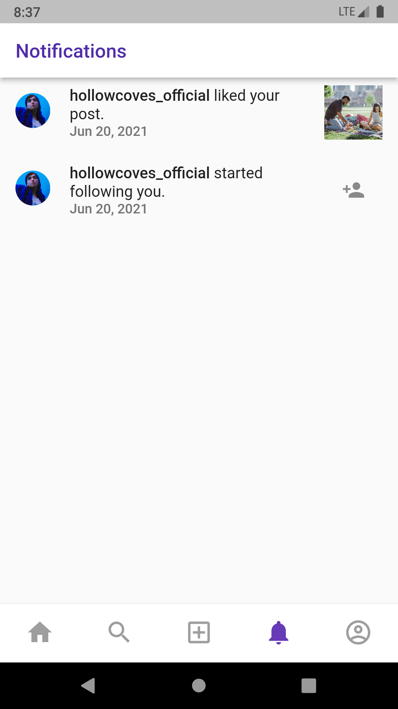

# Instagram Clone

A clone of instagram app made with flutter. Gives users the ability to post images, search, follow and unfollow other users.

## Details

• [BLOC](https://github.com/felangel/bloc/tree/master/packages/flutter_bloc) for state management

• [Firebase Auth](https://firebase.google.com/docs/auth) for user authentication

• [Cloud Firestore](https://firebase.google.com/docs/firestore) as the database

• [Cloud Functions](https://cloud.google.com/functions) for follow, unfollow and updating feed

• [Cloud Storage](https://cloud.google.com/storage) to store all images

## Screenshots

    

## Getting Started

This project is a starting point for a Flutter application.

A few resources to get you started if this is your first Flutter project:

- [Lab: Write your first Flutter app](https://flutter.dev/docs/get-started/codelab)
- [Cookbook: Useful Flutter samples](https://flutter.dev/docs/cookbook)

For help getting started with Flutter, view our
[online documentation](https://flutter.dev/docs), which offers tutorials,
samples, guidance on mobile development, and a full API reference.
